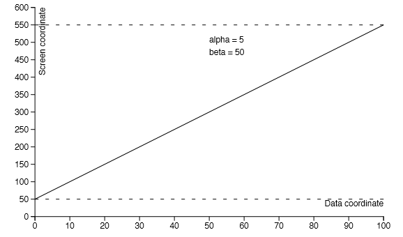
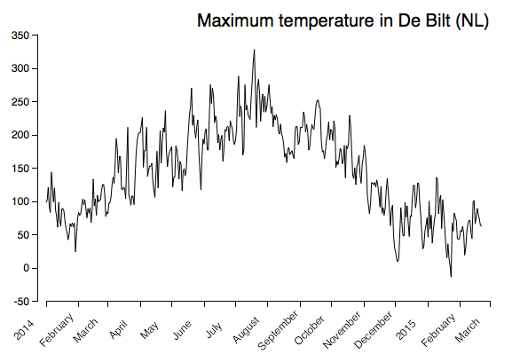

# JavaScript intro

The homeworks of coming weeks are all individual assignment. 
This week we will be working with JavaScript. JavaScript is the only programming language that is supported by
all modern web browsers and it is the least intrusive way of adding 
interactive elements to a web page as it requires no plug-ins or other
special extensions.

For this course we will be using the book [Eloquent JavaScript] by 
Marijn Haverbeke. This book assumes very little programming background but
goes into sufficient detail for our purposes. It is furthermore available
freely from the publisher's web site. 

Modern web browsers support two ways of creating graphics, the 
canvas-element provides raster graphics and Scalable Vector
Graphics (SVG) provide vector graphics. Raster graphics are specified as
a grid of colored image elements and vector graphics are specified as
a collection of shapes. Raster graphics become blurry (or show large
pixels) when they are enlarged while vector graphics remain sharp. We will
use both techniques to create visualizations.

[Eloquent JavaScript]: http://eloquentjavascript.net/

# Reading Assignment and Resources

Read chapters 1 through 5 and chapters 12 and 13 of [Eloquent 
JavaScript]. The first few chapters should be a quick read and the later chapters
explain how JavaScript integrates in the browser and how the Document
Object Model (DOM) is used from JavaScript. The Mozilla Developer 
Network [MDN] contains up-to-date information on client-side web technologies (i.e. about HTML,
CSS and JavaScript) and can serve as a reference. 

[MDN]: https://developer.mozilla.org

## Questions
Answer the following questions in your own words. This assignment will
only be graded pass or fail. 

* Explain the difference between the == operator and the === operator.
* Explain what a closure is. (Note that JavaScript programs use closures very often.)
* Explain what higher order functions are.
* Explain what a query selector is and give an example line of JavaScript that uses a query selector.

## Checks before submitting

* Create a folder Homework in your DataProcessing repository on GitHub. In folder Homework create folder Javascript and push a PDF file with the answers there.

# Javascript: line graph 

The assignment of this week is to create a line graph of
the temperature at the De Bilt weather station. We will implement this plot using JavaScript and the HTML 5 
canvas-element. The canvas-element provides an API with which graphics can be created using JavaScript. 

You will take the following steps to complete the assignment: acquire the raw data, convert it to
a CSV format, include it in a web page and write the JavaScript to show a simple line graph.

## Acquiring the Weather Data
Visit [KNMI webpage] that allows you to download raw weather station data in
CSV format. Select the De Bilt weather station, select the average temperature
records and choose a year for which you want to create a temperature 
graph. Download the data and verify that you have in fact one full year's
worth of data (files can be viewed in text editors). The downloaded 
file starts with a so-called header that contains meta-data. This
meta-data allows you to correctly interpret the raw data in the rest of the file.

[KNMI webpage]: http://projects.knmi.nl/klimatologie/daggegevens/selectie.cgi

## Reformatting and Loading the Data

To keep the complexity of loading the data low, we will not load it 
from an external file but embed it directly in the web page.
Create an empty html file and add a textarea-element to it. Normally 
these text areas are used in forms to get input from a user, but we will use
it to embed our data. Reformat the CSV file such that it only contains the
dates and the average temperatures. This will result in something like the
following snippet.

	<textarea id="rawdata">
	#date,maxtemp
	20140101,   99  
	20140102,  103 
	20140103,  122 
	20140104,   93  
	20140105,   84  
	20140106,  145 
	...
	</textarea>

For this assignment it is OK to add any JavaScript you write inside a script
tag at the very end of the HTML body. Handing in your code as a separate
script is also fine, but make sure that all the needed files are included.

You can now load the data by writing some JavaScript that selects
the text area (document.getElementById(...)) and then 
accesses its content. The content should be split 
into lines and then further split into two chunks, one for the date and
one for the average temperature. Now create an array of data points 
and use console.log(...) to see whether the data was in fact
loaded. Before moving on, make sure that the dates are in fact JavaScript
dates and the numbers JavaScript numbers. To convert date strings to
JavaScript dates use the Date function:
new Date(*dateString*) (make sure that the *dateString*
matches the example's formatting).

## The canvas-element

The HTML 5 canvas element allows JavaScript to draw pictures, the Mozilla
Developer Network has a small [tutorial] on the canvas-element that you should read. For this assignment you
will not need to know all the details of the canvas but you should be able 
to at least draw lines, rectangles, circles and text (and how to rotate text).

[tutorial]: https://developer.mozilla.org/en-US/docs/Web/API/CanvasRenderingContext2D

## Transforming the data to screen coordinates

The canvas-element provides its own coordinate system, you will have
to transform your raw data to these coordinates to draw the graph. 

The position encodings for this graph only need linear transforms, one for the x-axis and one for the y-axis, of the following form:
xscreen = alpha * xdata + beta 

Because finding the two constants *alpha* and *beta* is a bit tedious we will create a function that can do it for us. We will use JavaScript's support for *closures* to create a function *createTransform* that calculates *alpha* and *beta* and returns a transformation function. The following snippet of code demonstrates this technique, but you will have to implement the actual calculation yourself.

	function createTransform(domain, range){
		\\ domain is a two-element array of the data bounds [domain_min, domain_max]
		\\ range is a two-element array of the screen bounds [range_min, range_max]
		\\ This gives you two equations to solve:
		\\ range_min = alpha * domain_min + beta
		\\ range_max = alpha * domain_max + beta
 		\\ Implement your solution here:
 		var alpha = ...;
		var beta = ...;
		
		return function(x){
			return alpha * x + beta;
		};
	}
 
To test this function you can make a transformation that transforms the domain *[10, 20]* to the range *[10, 20]* and see whether points are transformed to themselves:

	var transform = createTransform([10, 20], [10, 20]);
 	console.log(transform(15));  // should log 15

 

The createTransform function will work directly on your 
temperature data, but for the dates along the x-axis there is an extra 
complication.

The x-transform needs to deal with dates, and any calculations involving
calendars tend to get complicated quickly. For this assignment it is ok
to use the Date.getTime() method to change all date
to milliseconds since January 1st 1970. These milliseconds can
then be transformed into days since the start of your data (so the x-axis
would run from 1 through 365 or 366 days depending on the year you chose).

Figure below shows you a simple example of a line plot for different dataset. It's definitely not complete, can you spot the missing elements? Include them in your version of the line plot for the average temperature in De Bilt. 

## Extra credit
* Create an x-axis that uses calendar dates (instead of days since the first date in the data set).
* Loading the data from file (you will need XMLHTTPRequest).
* Nice graphical presentation will be credited.

## Checks before submitting

* Does your graph contain all the elements of a clear and complete line graph?
* Push your files on GitHub in the folder Javascript.

[guidlines]: guidlines.pdf
