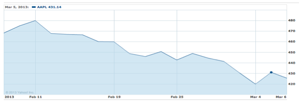

This homework is split over week 4 and 5 of the data-processing course. The total
exercise consists of ingesting a data set encoded as CSV (Comma Separated Values)
and one encoded as JSON (Javascript Object Notation), plotting the two data sets
on a so-called Canvas element, and then to add interactivity to that plot using
Javascript techniques. For some of you this excercise will be your first 
introduction to Javascript. 

The first part of the exercise (week 4) comprises only the loading of the data
and plotting the two data sets (statically). The second part (week 5) comprises
the the interactivity. 

As always if you need help, the first place you should check is Piazza because
likely someone else will have had the same problems as you!

## Web Visualization

This problem is intended to better acquaint you with web related technologies:
CSS3, HTML5 and Canvas. These technologies are particularly important in
visualization, because they allow you to control aspects related to the
presentation and style of documents.

As noted in class, browsers are better standardized when it comes to handling
HTML5, but they're still "not there yet". It's therefore important to note:

* All HTML5 documents must undergo validation with no errors at
  <http://validator.w3.org/>

* All CSS3 must undergo validation at <http://jigsaw.w3.org/css-validator/>

* CSS3 stylesheets must be implemented in separate files (.css), and linked
  with your HTML document by a corresponding `<link>` tag.

* Your implementation must work on Google Chrome. We'll conduct the tests of
  your homework in Chrome. We highly recommend you do the same.

Use a file called `index.html` as the main page of your code. Use a file
`style.css` for your CSS. Put these and potential other files in a folder
`lastname_hw5` in your zip file.

This homework will require you to create a line-chart based visualization, and
implement it entirely using HTML5 and Javascript. The result is similar to
finance.yahoo.com's stock visualizations which you can see in the following
figure.

## The Dataset

*Techniques demonstrated: Data formatting, CSV, JSON*

The logic required for chart visualization is largely agnostic of the actual
data. A chart can be abstracted by its two axes (call them "x" and "y") as well
as any additional data associated with a point (call it "comments"). You are
required to use two different datasets for this exercise, provided that a) both
conform to the "x" and "y" abstractions and b) both are from the same space
(i.e., their "x" and "y" axes are the same) . This requires charting the data
points into a format the browser logic can render. The two most popular formats
are Comma Separated Values (CSV) and Javascript Object Notation (JSON). You
should use both formats for this homework, i.e. the first dataset should be in
CSV, and the second in JSON.

In CSV, data is structured like this:

	Data Set Title
	X Data points title, Y Data points title
	X Data points units, Y Data points units
	x1-value, y1-value, comments1
	x2-value, y2-value, comments2
	x3-value, y3-value, comments3
	...

With "comments" potentially empty, if there are none for this specific data point.

A concrete example adhering to these conventions:

	Stock price of Apple (AAPL)
	Date, Price
	Day, $
	3/4/2012, 431
	3/5/2012, 420
	3/6/2012, 427
	...

This format is easy to use, and can be exported from many popular applications,
not the least of which is Microsoft Excel. It can become somewhat challenging
if the data itself contains a comma or new lines, however, as those characters
make up part of the formatting. Another downside is that it requires further
processing so as to load the values into memory. Fortunately, the Javascript
split() function lends itself easily to this task: Once for splitting the data
by lines (that is, on the newline (`\n`) character), and once for splitting the
line into the x and y coordinates (that is, splitting on the comma).

The other format, Javascript Object Notation (JSON) provides an even easier
method of loading into javascript, because the data is formatted in a way that
makes it a valid javascript statement. Loading and parsing JSON data can then
simply be performed through the use of JSON objects (which is supported by all
modern browsers) and JSON.parse(). Although an alternative way of loading JSON
data is to use Javascript's eval() function, use of eval() is discouraged as it
is associated with security breaches.

In JSON, data would look something like this:

	{
		"title": "Data set title",
		"x": {"title" : "Title of X-Coordinate", "units" : "Units" },
		"y": {"title" : "Title of Y-Coordinate", "units" : "Units" },
		"points":
			[
				["x1", "y1", "comments"],
				["x2", "y2", "comments"],
				...
			]
	}

For example:

	{
		"title" : "Stock price of Apple (AAPL)",
		"x" : { "title" : "Date", "units" : "day" },
		"y" : { "title" : "Price", "units" : "$" },
		"points":
			[
				[ "3/4/2012", "431", "Rumors of i-Watch" ],
				[ "3/5/2012", "420", "disillusionment" ],
				[ "3/6/2012", " 427", "" ]
			]
	}

TIP: There are myriad JSON validators you can use to make sure your format is
correct (e.g., jsonlint.com). If cutting/pasting, take note to ensure that the
quotes (") are indeed standard double quotes(".."), and not word-processing
quotes ("..").

For this exercise, we ask you to find two different data sets and store one in
CSV and one in JSON format. Make sure to pick two different but related point
collections. Specifically, they should use the same coordinate system (for
example, two stock quotes from different companies). Most visualizations
separate the data from the visualization logic (i.e., the data is stored in one
and the visualization code in another file on the web server). For our purposes
it's fine to leave the data and the code in the same file, e.g., in a hidden
`<textarea>` or `
`. Here is an example how to do that:
	
	<body>
	<!-- Dont forget to make the textareas invisible using CSS! -->
	<textarea id="csv"> ... place CSV data here</textarea>
	<textarea id="JSON"> ... place JSON data here</textarea>
	
	..

Make sure both data sets are viewable on the same set of chart coordinates, or
be ready to dynamically adjust the range of the coordinates.

## Preparing the page template

*Techniques demonstrated: HTML5, CSS3*

Your web-based visualization "lives" inside an HTML document. HTML5 is the
current standard. Prepare a visualization template page, with the following
element of:

* The visualization canvas area (`<canvas>`)

* The document header (`<header>`)

* An optional document footer (`<footer>`)

* A description, consisting of a few paragraphs, of what your selected
  visualization is about (placed inside a `
` element)

* A control panel for the visualization, which will later hold GUI controls.
  This is a placeholder `
` element, to which you can later add buttons and
  input boxes to control the visualization.

* Any additional elements you see fit. These could include buttons, input
  boxes, combo boxes, or any other input controls you would like to add to your
  visualization (to enable the user to filter, zoom, etc.), which you can add
  to the control panel.

You have free reign in styling the page – with one important note – all styling
MUST be done via CSS in an external stylesheet. This means that your HTML
elements should basically be devoid of attributes (i.e., look like `<element>`
and not `<element attr="..">`, with the exception of the "id" or "class"
attributes, which is important for DOM manipulation.

## Drawing the canvas

*Techniques demonstrated: Canvas*

The HTML5 Canvas element is true to its name: A blank canvas on which artistry
is only limited by your imagination (and Javascript skills). Whereas
traditionally on-the-fly animation requires the use of Java, or of
Macromedia/Adobe's flash plugin, the canvas allows you to alleviate the need
for any plugins, which is especially useful in cases where flash is not
supported (especially mobile browsers).

Create a canvas to contain your chart. This was shown in lecture, and requires
you to specify in HTML the canvas placeholder dimensions (i.e., 
`<canvas width=".." height="..."`). Draw the X and Y axes on the canvas. You'll use the
same canvas for both axes and data points, so make sure to (a) draw the axes
using a different stroke style than the data points, and (b) remember that the
data points are likely going to be limited to a (slightly) smaller area of the
canvas.

Using both of the datasets you have prepared, loaded into an object (via JSON
or the javascript split, as discussed previously), iterate over the data points
(in a javascript loop) and:

* draw a pixel in its right respective location to represent the data point
  iterated on,

* draw a line connecting the newly created pixel with the previous pixel. Note
  that when connecting pixels with lines, order matters! If your data points
  are improperly sorted, what should otherwise be a neat polyline will end up a
  tangled mess.

* optimize the data range – especially in the Y axis – for display. This means
  that you will want to figure out the minimum and maximum values of each
  coordinate a priori, so as to neither exceed the bounds nor leave too much
  white space.

You must implement the drawing in a generic function and call it twice (once
for each data set).

## Problem 2: Questions about the [reading 3][]

1. Ware describes bottom up and top down processing of visual information in
   the brain. Give a concrete and detailed example of how bottom up processing is
   influenced by top down processing, leading to a potentially wrong
   interpretation of "reality" by the viewer. Your example can include a
   screenshot, photo, or web site URL to refer to the scene that is being viewed.

2. Go to the Many Eyes website and browse around the visualizations. Click
   through a few and look at the comments. How successful do you think Many Eyes
   has been in achieving its original design purpose according to the paper? What
   do you think is the biggest issue/flaw with Many Eyes? What improvements might
   you suggest to Many Eyes to address these issues/flaws?

[reading 3]: /readings/reading-3

## Submitting

Your submission should be a `zip` file containing the following:

* A directory called `javascript1` containing all the files that belong to 
  the static visualization created using Javascript.
* The answers to the questions for reading 3 in a file called `reading3.pdf`
