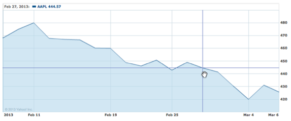

This homework is the second part of the Javascript, Canvas and Interactivity
exercise (you cannot work on this exercise without having finished the homework
of week 4).

## Interactivity

*Techniques demonstrated: hover (onMouseOver), Tooltip*

Providing the user with a line chart is great, but often the resolution is
insufficient for the user to figure out the points of interest. It's much
easier to add interactivity, by allowing the user to hover over the data points
and show more detail – such as the exact point value or any additional
information. This is where the "comments" fields in your data come in.

Add interactivity to your canvas by installing a handler on its mouse move
event. As shown in the lecture and the lab, this involves setting the
Javascript "onmousemove". When the user moves the mouse, change the cursor into
a cross hair, and extend the cross hair both horizontally and vertically, so
that the user can easily see its position. Where the cross hair extension
intersects with the graph (by the same x-coordinate) is the point of interest,
as shown in the next figure.

Display the details of this point – its x, y values and any additional comments
– in the details div, below or above the chart (using innerHTML, as discussed
in lecture) -see figure above ("Feb 27,2013").

In addition you should implement a tool tip showing the same information as
demonstrated in lecture and the lab. A tool tip is nothing more than a styled
floating `
` element, positioned on the fly at (or close to) the current
mouse coordinates. It makes sense to display the tooltip, however, only after a
very short timeout, since otherwise it will follow the mouse around (which can
get quite annoying). A good trick for tooltips is to use setTimeout() to
schedule a tooltip, but keep canceling the timeout as long as the mouse is
moving (using clearTimeout in the mouse move handler).

## More Interactivity

*Techniques demonstrated: element onclick, dynamic rendering*

Using HTML, Add a checkbox (`<input type="checkbox">`) to the chart's control
area for each dataset you are using. The checkbox's caption should be the same
as the name of the data set. On clicking the checkbox, the canvas should render
the data set of that element. If the checkbox is unchecked, the canvas should
remove the line corresponding to the data set of the element removed. Because
the canvas is a raster element, this requires "drawing over" the line with a
line that has the same color as the canvas background. Recall line drawing is
done by:

	

Note: Both your data sets should share the same coordinate system, but it's
likely you will need to perform some adjustments, for example, if drawing the
stock quote chart of an expensive stock (GOOG) and a cheaper one (ZNGA). In
that case, you will have to use a coordinate range that will allow you to
render both, or use an alternate system (e.g., percentage of change in value).

Add an additional checkbox titled "crosshair", to disable/enable the crosshair
extension lines. This should not disable the tooltip functionality, nor the
crosshair cursor – just the extension lines. In other words, when the checkbox
is clicked your event handler (onclick) should toggle some global variable
enabling or enabling the logic you have added.

## Submitting

Your submission should be in `hw5.zip` and include the following items:

* Include your HTML, CSS, Javascript, any needed images in your submission. 
* You can include a README.txt describing the system and browser you 
  developed on.
