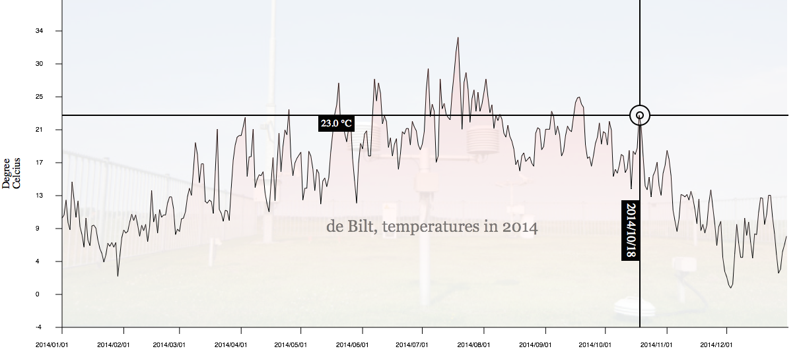

# Interactivity in Javascript

The interactive features you will implement are a tooltip that shows
the exact temperature for a given day and an cross-hair that follows the 
X position of the mouse cursor and the Y position of the graph. The tooltip will
be implemented as an absolutely positioned div-element and the
cross-hair will be drawn on a canvas-element. 

## The cross-hair and event listeners

First create a second canvas-element that we will use to draw the 
cross-hair on. This canvas-element must be positioned over the 
graph and be the same size. By drawing all the interactive features on this
second canvas you will not have to redraw the whole graph when you update the
cross-hair. You can use a trick to erase the canvas, overwrite its width
or height properties with their previous values.

To draw the cross-hair in the correct position you need the position of the 
mouse (relative to the canvas). This position can be determined by listening
for mouse move events and implementing an appropriate callback. Register an
event listener on the top canvas-element that listens for 
mousemove-events. In the callback access the clientX and
clientY properties of the event that was fired, these properties have
the mouse position relative to the whole document (not in "canvas"
coordinates). Use getBoundingClientRect() of the 
canvas-element to correct the mouse position. As always you should 
use console.log to see what the actual coordinates are.

Now that you have access to the x-coordinate of the mouse relative to the 
canvas element you can find the height of the graph at that position. You 
do this by transforming the x-coordinate relative to the canvas back to "data" coordinates (use last week's createTransform) and looking
up the nearest temperature value. That temperature value can then be used to
find the y-position relative to the canvas. You now have the coordinates 
where the horizontal and vertical lines of the cross-hair should cross. Draw
the cross hair.

## The tooltip and *setTimeout*

The second interactive feature we are going to implement is a tooltip that 
appears several seconds after the mouse stopped moving and shows the 
actual, precise, data value under the cursor. The tooltip should be a 
div-element that you position absolutely on top of the two
canvas-elements and slightly offset from the mouse pointer. First
create this div make sure it shows the temperature and date of the
point that is under the cross-hair. Make the tooltip move with the mouse (that
is update its position when a mousemove-event is fired). 

The tooltip should not be showing the entire time and thus we will implement a 
delay to the moment that it shows up. Make sure that the drawing and updating
of the tooltip is encapsulated in a function. Use the setTimeout
function to delay the drawing of the tooltip (so make it call your tooltip
drawing function as a callback). Make sure you make the tooltip invisible when
the mouse starts moving again. 

Figure 1 shows an example (not complete) of the full graph.

