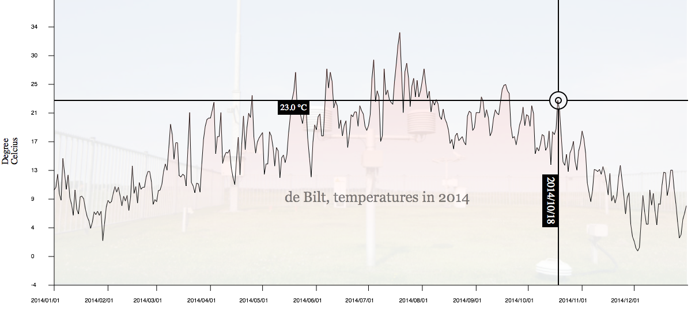

# Interactivity in Javascript

## Reading Assignment and Resources

This week's assignment is to add interactivity to last week's visualization
and to load the data formatted as JSON (JavaScript Object Notation) instead
of CSV. To prepare read chapters 6 (about JavaScript objects and inheritance),
8 (error handling), 10 (modules) and 14 (event handling) of [Eloquent
JavaScript]. JSON itself is not explained in a lot of detail in this book, but
the Wikipedia page on JSON and the [json.org] should provide
you with enough background on JSON. If you are interested in more advanced
background reading on JavaScript the series of books [You don't know
JavaScript] and the [JavaScript Garden] are great resources.

[json.org]: json.org
[You don't know JavaScript]: https://github.com/getify/You-Dont-Know-JS
[JavaScript Garden]: http://bonsaiden.github.io/JavaScript-Garden/
[Eloquent JavaScript]: http://eloquentjavascript.net/

### Questions
Answer the following questions in your own words. This assignment will
only be graded pass or fail.

* Why is it useful to encapsulate JavaScript code in a module as
      described in chapter 10 of [Eloquent JavaScript]?
* Describe what asynchronous programming is and how it differs from
      the style of programming you used in C and Python.
* Is JSON valid JavaScript? Describe the differences between JavaScript
      and JSON.

### Reformatting the data to JSON

Since JSON is commonly used to transfer data between JavaScript programs and
web services that provide data such as [overheid.nl], we will transform our CSV data to JSON using
Python, and then load that JSON data using the same trick as last week. In
Python the *json* module provides a very easy way to save Python 
data structures as JSON. You should take the data of last week, load it into
Python and create a list of lists of the data. This can then be saved as 
JSON using the *json* module's *dump* function. Take your
submission of last week, remove the CSV data from the text area and replace
it with the JSON data (JSON is very close to JavaScript in appearance, and
like JavaScript it is just text).

[data.overheid.nl]: https://data.overheid.nl/

### Loading the data using JavaScript

As before you can access the JSON data as a string by selecting the 
textarea-element and grabbing its value. Use the built-in 
JSON.parse function to load the data (never use eval
as it can lead to security issues). See what your data looks like with
console.log before moving on. If you see a *null* value for
the data you loaded most likely was not formatted correctly.

As you can see the JSON data that was loaded consists of an array of arrays
containing the data, much like the data structure you created last week. You
should therefore be able to re-use much of the JavaScript code you used last
week. Make sure your graph, based on the JSON data, looks the same as the 
graph based on the CSV data.

### Interactivity

The interactive features we will implement this week are a tooltip that shows
the exact temperature for a given day and an cross-hair that follows the 
X position of the mouse cursor and the Y position of the graph. The tooltip will
be implemented as a absolutely positioned div-element and the
cross-hair will be drawn on a canvas-element. 

### The cross-hair and event listeners

First create a second canvas-element that we will use to draw the 
cross-hair on. This canvas-element must be positioned over the 
graph and be the same size. By drawing all the interactive features on this
second canvas you will not have to redraw the whole graph when you update the
cross-hair. You can use a trick to erase the canvas, overwrite its width
or height properties with their previous values.

To draw the cross-hair in the correct position you need the position of the 
mouse (relative to the canvas). This position can be determined by listening
for mouse move events and implementing an appropriate callback. Register an
event listener on the top canvas-element that listens for 
mousemove-events. In the callback access the clientX and
clientY properties of the event that was fired, these properties have
the mouse position relative to the whole document (not in "canvas"
coordinates). Use getBoundingClientRect() of the 
canvas-element to correct the mouse position. As always you should 
use console.log to see whether what the actual coordinates are.

Now that you have access to the x-coordinate of the mouse relative to the 
canvas element you can find the height of the graph at that position. You 
do this by transforming the x-coordinate relative to the canvas back to "data" coordinates (use last week's createTransform) and looking
up the nearest temperature value. That temperature value can then be used to
find the y-position relative to the canvas. You now have the coordinates 
where the horizontal and vertical lines of the cross-hair should cross. Draw
the cross hair.

### The tooltip and *setTimeout*

The second interactive feature we are going to implement is a tooltip that 
appears several seconds after the mouse stopped moving and shows the 
actual, precise, data value under the cursor. The tooltip should be a 
div-element that you position absolutely on top of the two
canvas-elements and slightly offset from the mouse pointer. First
create this div make sure it shows the temperature and date of the
point that is under the cross-hair. Make the tooltip move with the mouse (that
is update is position when a mousemove-event is fired. 

The tooltip should not be showing the entire time and thus we will implement a 
delay to the moment that it shows up. Make sure that the drawing and updating
of the tooltip is encapsulated in a function. Use the setTimeout
function to delay the drawing of the tooltip (so make it call your tooltip
drawing function as a callback). Make sure you make the tooltip invisible when
the mouse starts moving again. 

Figure 1 shows an example of the full graph.

### Checks before submitting

* Does your submission also contain the Python script you used to
         create the JSON data?

