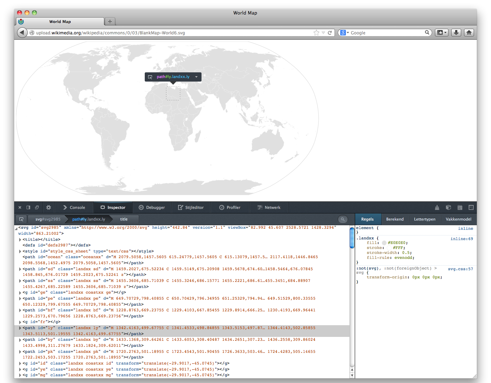
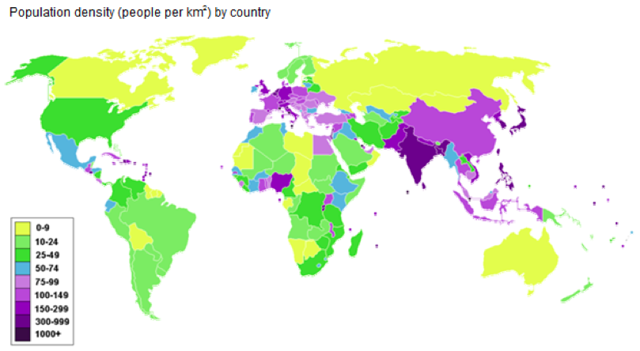

## SVG

In this homework you will learn to manipulate maps using Javascript. The maps
for the assignments below are in the Scalable Vector Graphics (SVG) format.
Much like HTML SVG can be manipulated from Javascript through the Document
Object Model (DOM). For this week's homework you will create 3 static maps
using SVG, CSS and Javascript.

Note: This homework comes with supplementary files which you can download
[here](hw7files.zip). Another file that is very useful is the mapping between
[country codes and country names](countries.js).

## Resources

### Scalable Vector Graphics

* [SVG tutorial] from the *Mozilla Developer Network*
* [SVG Documentation] from the *Mozilla Developer Network*: Documentation on
  SVG elements and what dimensions are needed.
* [W3Schools SVG tutorial]

_SVG was also explained in the lectures._

[SVG Documentation]: https://developer.mozilla.org/en-US/docs/Web/SVG
[SVG tutorial]: https://developer.mozilla.org/en-US/docs/SVG/Tutorial
[W3Schools SVG tutorial]: http://www.w3schools.com/svg/default.asp

### General
The [Resources Page] with many more resources for the curious!

[Resources Page]: /resources/cs171-resources

## Problem 1: SVG Maps

SVG, as described in class, is a vector­based alternative to the raster­based
Canvas. It is especially useful in cases where you want to interactively modify
your drawn shapes such as areas on a map.

The point of departure for this visualization is the world map. A freely
available SVG world map such as the one [on Wikimedia], makes a great start.
The map is fairly accurate, and each country is well delineated by its own
`<path>` (or several `path`s). Using a DOM inspector (such as Firefox’s Web Developer Toolbar or
Chrome’s Developer Tools (View > Developer > Developer Tools), shown below),
you can examine the SVG’s DOM structure, as well as identify the `<path>`
elements which make up the countries.

[on Wikimedia]: http://en.wikipedia.org/wiki/File:BlankMap-World6.svg

In this problem, you will write a JavaScript function to change the fill color
of a country in a specific continent.

### Continent setup

Using the inspector, isolate the countries that make up a continent of your
choice – pick one of:

* North America
* South America
* *Europe* (suggested)
* Africa
* Asia

(Sorry but Antarctica is not a valid choice!) You only need to isolate the
major countries of the continent; no need to examine all the tiny islands.

You have received three starter files with this homework: `svg.html`,
`svg.css`, and `main.js`.

Begin by working on `svg.html`. Gather up the appropriate svg data you need
from the above map and paste it into `svg.html`. You may also alter the svg
window and `viewBox` properties to crop your continent or otherwise change the
bounding box on the map to your liking. The countries on the map are already
marked with appropriate ids/classes.
In `svg.css`, change the fill color for the continent (by class) to some color
(not white), as well as the fill color of two or three countries in the
continent (by ID) to other colors of your choice.

### Programmatically change the color of a country

In `main.js`, write a function, `changeColor()`,that does what you did in `svg.css`
via JavaScript instead. Complete the `changeColor()` function here, which will
take as arguments the id of a path (country) and a fill color. This will come
in handy since most visualizations will want to color countries on-the-fly.

Then make sure your changeColor() function works by calling the function on 4
different countries than those you have changed via CSS in your chosen
continent when the page loads. Make sure that these colors are different than
those you have changed via CSS.

### Submit
Submit your completed files in a folder titled SVG2 containing `svg2.html`,
`svg2.css`, and `main2.js`. Don't forget to change the references in
`svg2.html` to reflect the changed stylesheet and js file names!

## Problem 2: Analyze Geographical Data with SVG

In Problem 2, you will extend Problem 1 by preparing a dataset of
geographically indexed data in the JSON format and using this data set to
create a color­encoded map of your continent. Create new files, svg3.html,
svg3.css, and main3.js, based on your problem 2 solution.

### Acquire and prepare your data

Prepare a dataset (your choice) of geographically indexed data. That is, you
can choose any data set provided the data set points are indexed by country.
Examples include world population by country, literacy rates by country, etc.
Wikipedia has good examples like [List of Countries by Population] and [List of
Countries and Dependencies by Population].

[List of Countries by Population]: http://en.wikipedia.org/wiki/List_of_countries_by_population
[List of Countries and Dependencies by Population]: http://en.wikipedia.org/wiki/List_of_countries_and_dependencies_by_population_density

Convert the data into JSON format (if necessary), and embed it into the
svg3.html document. This means your data will look something like:

	{
		data : "title",
		points : [ /* Array of points follows.. */
			/* For each point, index is some country name */
			[ "country1" , "country1_data"],
			[ "country2" , "country2_data"] ...
		]
	}

### Color code your map

Using JavaScript, iterate over your dataset. For each country in the dataset,
locate the appropriate path with the same ID, and adjust its fill style to
reflect the data by color coding.

That is, you may now get rid of any arbitrary colors applied from the previous
problem using CSS and only color countries by their encoded data.

You do not have to do this for ALL countries, just countries in your selected
continent. Your iteration loop can simply "skip" over countries whose
corresponding paths are not tagged in the SVG.

The color coding is left up to you though you have to justify it. Choose a
spectrum which maps to the range of your data points. For example, a
population's range is from about 10,000 (Tuvalu) through 1,350,000,000 (China).
Again, appropriate examples can be chosen from the Wikipedia lists above.

### Add the details and discuss your implementation

This should look something like the following (again, an example of population
density):

[population density]: http://en.wikipedia.org/wiki/List_of_countries_and_dependencies_by_population_density

You should also place a title above your graph. Though the example above
includes a legend, this is not required.

At the bottom of `svg.html` ( *visible when the page is viewed in a web browser* 
), explain why you chose the colors you did for your
map. Try to invoke some of the principles of color mentioned in lecture
including the type of color series you are using (sequential, diverging, etc,
and also note that the above example may or may not be a good example of color
choice). Also, explain your reasoning behind creating the bounds for each
category in your encoding.

### Submit
Submit your completed files in a folder titled SVG3 containing `svg3.html`,
`svg3.css`, and `main3.js`. Note that you may not need `svg3.css` here unless
you would like to change additional styling with regard to text, margins, etc.

### Checklist 

* Are all the files present and in the correct relatice paths?
* Does your scritp use a strict mode (i.e. does it start with "use strict"; and still works)?
* Do you have enough comments and are your variable names appropriate?
