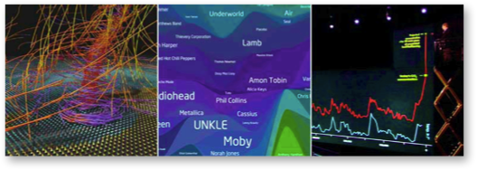

*Edition: September 2014 (beta version)*
*Currently being edited (2014-09-07)*

The amount and complexity of information produced in science, engineering,
business, and everyday human activity is increasing at staggering rates. The
goal of this course is to expose you to visual representation methods and
techniques that increase the understanding of complex data. Good visualizations
not only present a visual interpretation of data, but do so by improving
comprehension, communication, and decision making.

{:.inline}

In this course you will learn how the human visual system processes and
perceives images, good design practices for visualization, tools for
visualization of data from a variety of fields, collecting data from web sites
with [Python](http://www.python.org/), and programming of interactive web-based
visualizations using [D3](http://d3js.org/).

## Staff

The course's staff consists of your instructor and several student assistants.
Due to the size of the course, we can't usually respond to email inquiries
about your problem sets or organizational matters. You are encouraged to speak
to a student assistant or the instructor at the lab.

Gosia Migut  
*instructor*
<data@mprog.nl>

Jasper Linmans
*teaching assistant*

## Goals for this course

After successful completion of this course, you will be able to...

* Critically evaluate visualizations and suggest improvements and refinements
* Use Python and other tools to scrape, clean, and process data
* Use standalone visualization applications to quickly explore data
* Apply a structured design process to create effective visualizations
* Use principles of human perception and cognition in visualization design
* Create web-based interactive visualizations using Javascript and D3
* Conceptualize ideas and interaction techniques using pen and paper
* Use storytelling principles to design coherent and clear visualizations

## Prerequisites

You'll need programming experience in a language like C, Ruby or Python.

## Expectations

You are required to work in the lab for some amount of time during the week, as
agreed upon before starting the course. You are expected to watch all lectures
and sections, submit all homework assignments, and submit three projects. You
are also expected to meet a course assistant to discuss each deliverable and
improve on your work.

## Grades

The grades will be awarded on the standard Dutch 1-10 scale. There are 7
homework assignments that will be graded, all mandatory and to be handed
in on schedule. Class participation is required (both the reading sessions
and the desiggn critique sessions). 
