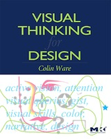

*Edition: September 2014 (beta version)*
*Currently being edited (2014-09-07)*

The amount and complexity of information produced in science, engineering,
business, and everyday human activity is increasing at staggering rates. The
goal of this course is to expose you to visual representation methods and
techniques that increase the understanding of complex data. Good visualizations
not only present a visual interpretation of data, but do so by improving
comprehension, communication, and decision making.

{:.inline}

In this course you will learn how the human visual system processes and
perceives images, good design practices for visualization, tools for
visualization of data from a variety of fields, collecting data from web sites
with [Python](http://www.python.org/), and programming of interactive web-based
visualizations using [D3](http://d3js.org/).

## Staff

The course's staff consists of your instructor and several student assistants.
Due to the size of the course, we can't usually respond to email inquiries
about your problem sets or organizational matters. You are encouraged to speak
to a student assistant or the instructor at the lab.

### Instructor

Thijs Coenen  
<t.coenen@uva.nl>  

## Goals for this course

After successful completion of this course, you will be able to...

* Critically evaluate visualizations and suggest improvements and refinements
* Use Python and other tools to scrape, clean, and process data
* Use standalone visualization applications to quickly explore data
* Apply a structured design process to create effective visualizations
* Use principles of human perception and cognition in visualization design
* Create web-based interactive visualizations using Javascript and D3
* Conceptualize ideas and interaction techniques using pen and paper
* Use storytelling principles to design coherent and clear visualizations

## Prerequisites

You'll need programming experience in a language like C, Ruby or Python.

## Expectations

You are required to work in the lab for some amount of time during the week, as
agreed upon before starting the course. You are expected to watch all lectures
and sections, submit all homework assignments, and submit three projects. You
are also expected to meet a course assistant to discuss each deliverable and
improve on your work.

## Grades

Your final grade will be determined by the number of points you collect. You
can collect various amounts of points for the different parts of the class:

The grade of **Data Processing** will be determined using the following weights:

* Homework: 90%, assessed on your individual and on your group reflection
  submission, as stated above.

* Participation: 10% assessed on participation on Piazza and lecture and lab
  attendance.

The grade of **Data Project** will be determined using the following weights:

* Projects, as assessed on meeting the project criteria as described in the
  project handouts.

Homework, projects, and participation will be graded on a 5 point scale in 0.5
increments using the following scale:

* 5 = Exceptional / above and beyond (we will only give out these for best projects)
* 4 = Solid / no mistakes (or really minor)
* 3 = Good / some mistakes
* 2 = Fair / some major conceptual errors
* 1 = Poor / did not finish
* 0 = Did not participate / did not hand in

A 4 constitutes a perfect grade, and getting all 4s is equivalent to an A. A
combination of 4s and 3s end up being A- to B, and so on. Course assistants will
evaluate your work holistically beyond mechanical correctness and focus on the
overall quality of the work. In addition to the scores the course assistants
will give detailed feedback.

Keep in mind that your grade is also determined by your (genuine) effort, not
only on correctness. There are several reasons for this approach. First, in
design activities, risk-taking and wrong turns are a fact of life. Penalizing
mistakes discourages risk-taking and creativity. Second, this approach allows
you to control your effort better compared to trying to get open-ended problems
right. Third, any anxiety associated with getting things right interferes with
learning. If you enjoy this course, you will learn so much more!

The course is not graded on a curve. The course does not have pre-determined
cutoffs for final grades. Scores on projects' milestones may be normalized
across graders at term's end. Each student's final grade is individually
determined after input from the teaching fellows. Prior experience, remarkable
effort, and upward trending may be considered.

## Book

{:.inline}

[Visual Thinking for Design](http://www.amazon.de/Visual-Thinking-Kaufmann-Interactive-Technologies/dp/0123708966/), Colin Ware, Morgan Kaufman (2008)

All the clanking gears are here: variable resolution image detection, eye
movements, environmental information statistics, bottom-up/top-down control
structures, working memory, the nexus of meaning, and specialized brain areas
and pathways. By the time he’s done, Ware has reconstructed cognitive
psychology, perception, information visualization, and design into an
integrated modern form. This book is scary good. --- Stuart Card, Senior
Research Fellow, and manager of the User Interface Research group at the Palo
Alto Research Center
